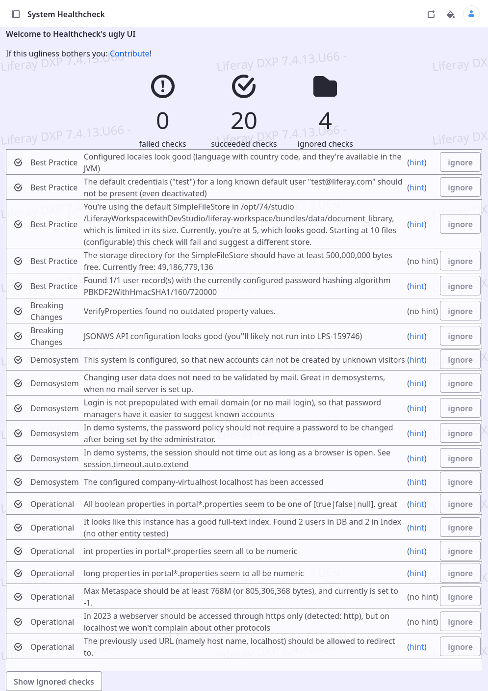

# Healthcheck

This is a modernized implementation of various healthcheck modules.

Most attention has been given to implement the backend, and there's a very simplistic frontend

This project currently consists of:

* Breaking Changes implementations
    * Checks VerifyProperties (with a copy from Liferay's portal-impl code). Liferay itself runs this code
    only during upgrades, but it can point out older configurations that have been migrated to OSGi config, 
    or discontinued
* Best Practice implementations
    * e.g. "Do not use default user accounts & passwords"
    * Check if the DEV feature "trust all self-signed certificates" has been activated
    * Check if your password hashing configuration adheres to current OWASP Best Practices
    * Check a select number of users for the actual hashing used (they might not have logged in, so that 
    hashing has not been updated to the current configuration)
    * Check the remaining Premium Support period for DXP and signal before it comes to an end
    * (Liferay DXP only) Check available updates and signal when more than x updates or patches are 
    available for your current release, for more than y weeks. Configurable for duration and LTS preference
    * (Liferay Portal only) Check for an available update and signal when it's available
    * Check if the currently used JVM supports all locales that you have configured your Liferay 
    DXP or Portal instance to serve.  
* Operational implementations    
    * e.g. checks for available memory and redirection configuration
    * Checks for problematic portal-ext.properties configurations - e.g. duplicated configurations that
    cause misconfiguration for boolean or numerical properties (see LPS-157829)
    * Check for unsupported Elasticsearch setups (sidecar)
    * Check for Client Extensions and Form-DataProviders embedding code from external hosts (as these might
    need to be updated between PRD/UAT/DEV environments)
    * Check for validity duration of DXP Activation Key
    * optionally detecting if a backup (e.g. from PROD) has been restored in a different system (e.g. to UAT), 
    based on the used hostnames
    * Some optional checks depend on a filter that intercepts a low default number of first requests after 
    server-start and is deactivated afterwards (for performance reasons)
    * Checks for certificate validity of systems that this system is connected to (e.g. Client Extensions, 
    Data Provider, Web Hook, and a list of explicitly configured additional hosts). Warns a configurable
    amount of weeks before the certificate expires
    * Tests if an Elasticsearch-Reindexing is required (simply by comparing the number of users found in
    the database with that from search index) 
* Relaxed Settings
	* Allows to configure specific host names (e.g. localhost) that are tested for relaxed settings,
	so that you can more comfortably develop new features without being bothered by an extra-secure
	password policy (and others)
...and maybe more that haven't been referenced in this document...

## How to build

This is a standard Liferay Workspace. Clone, build and deploy

This repository is used as the backend for publishing an app on Liferay Marketplace, 
so you'll be able to have it work without building it in any way.

The code is meant to be compiled and run on Java21, which is why releases are only available for 
DXP-2024-Q2/Portal-GA120 and later, when this compatibility has been added.

Note: Some DXP/Portal code has been copied over. This duplication allows the same code to compile
for all supported versions without using a new or deprecated API that might not compile or 
compile well on some versions.

Each version's VerifyProperties class has been copied over and adapted to store its output in
the Healthcheck format, rather than in log. Also, this copy doesn't call System.exit().

## Reference

* [LPD-253](https://liferay.atlassian.net/browse/LPD-253)

## Limitations

* Very basic permission checking. Health Check UI is only available for Instance Administrators.
* UI is veeeeery barebones right now 
* Not much thought has been given to scenarios with multiple instances that might have different
 - instance specific - configuration.

## Ideas for more health checks

### Operational

* Validate that AVIF and WEBP image formats are fully handled (LPD-23363)

## Ideas for the UI

The UI is - explicitly - _very_ ugly. To make its ugliness even more explicit, it's minimally interactive and 100% built with `<table>`.

 

You can ignore some healthchecks (successful or unsuccessful). They'll still be executed, but the result will not be shown.
 
Collecting a few ideas that could go into UI features:

* Get rid of the <table> based layout to begin with
* Run healthchecks in background (scheduled) - this enables long running processes to run as well (see remark about locale though) 
* Filter/Sort results by category/result
* Activate/Deactivate certain categories (e.g. ignore demo-related healthchecks with released security) or pick individual checks to run and blacklist completely.
* Build a Dashboard of different Healthcheck results, allowing graphical output
* Provide an API to reveal (pull or push) results to Liferay Cloud Console or other external entities.

## Visualize Results on a site, instead of a Control Panel app

If you want to show the result of healthchecks to administrative users, you can do this with a fragment like the following.
In this case, it'll signal if healthchecks didn't run since server-restart, or if they had failed (and non-ignored) checks.
This sample fragment will render empty if it can't find any healthcheck or the components introduced.

	

	[#if (healthcheckFailures > -2)!false]
	  [#if healthcheckFailures = -1]
	  	

		    

	        This system features some healthchecks as a self-test mechanism.
	        Please
				  <a href="/group/guest/~/control_panel/manage?p_p_id=com_liferay_portal_health_web_portlet_HealthcheckWebPortlet">
	  				check if the system requires maintenance
	        </a>.
		    

		    

				  (This marker disappears when there are no more problems)
	    	

		  

	  [#elseif healthcheckFailures != 0]
		

			

				Healthchecks signal ${healthcheckFailures} problem(s). Please 
				<a href="/group/guest/~/control_panel/manage?p_p_id=com_liferay_portal_health_web_portlet_HealthcheckWebPortlet">
					run them again
				</a>
				and fix (or ignore) them explicitly
			

			

				(This marker disappears when there are no more problems)
			

		  

	  [#else]
		<!-- No output, so that this fragment stays on a page in a template system -->
		<!-- without disturbing the page, but becomes active, when necessary -->
	  [/#if]
	[#else]
		

	 	  Healthcheck Status unknown. You may need to install an additional plugin,
			or check for the reason why it didn't deploy.
		

	[/#if]
	

ugly CSS suggestion for the fragment: (in this case, ugly is a feature, as it should lead
to the healthchecks being run/fixed)

	.fragment_6101 .has-content {
		border-color: var(--danger);
		border-style:dashed;
		padding: var(--spacer-2, 0.5rem) !important;
		margin-bottom: var(--spacer-5, 0.5rem) !important;
		font-size:1.5rem;
	}

